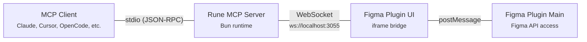

# Rune — Figma MCP Server

Control Figma directly from AI assistants via the [Model Context Protocol](https://modelcontextprotocol.io). Create, style, and manipulate design elements using natural language through any MCP-compatible client.

## Architecture



**Data flow:** MCP Client → stdio → Rune Server → WebSocket → Plugin UI → postMessage → Plugin Main → Figma API → response flows back the same path.

## Prerequisites

- [Bun](https://bun.sh) v1.0+
- [Figma Desktop](https://www.figma.com/downloads/) (plugin requires desktop app)

## Setup

```bash
# 1. Install dependencies
bun install

# 2. Build the Figma plugin
bun run build:plugin

# 3. Load plugin in Figma
#    Figma Desktop → Plugins → Development → Import plugin from manifest
#    Select the manifest.json in this directory

# 4. Run the plugin in Figma
#    Right-click canvas → Plugins → Development → Rune
#    Wait for the green "Connected" indicator
```

## MCP Client Configuration

### Claude Desktop

Add to `~/Library/Application Support/Claude/claude_desktop_config.json` (macOS) or `%APPDATA%\Claude\claude_desktop_config.json` (Windows):

```json
{
  "mcpServers": {
    "rune": {
      "command": "bun",
      "args": ["run", "server"],
      "cwd": "/absolute/path/to/rune"
    }
  }
}
```

### Cursor

Add to `.cursor/mcp.json` in your project root or `~/.cursor/mcp.json` globally:

```json
{
  "mcpServers": {
    "rune": {
      "command": "bun",
      "args": ["run", "server"],
      "cwd": "/absolute/path/to/rune"
    }
  }
}
```

### OpenCode

Add to your OpenCode MCP configuration:

```json
{
  "mcpServers": {
    "rune": {
      "command": "bun",
      "args": ["run", "server"],
      "cwd": "/absolute/path/to/rune"
    }
  }
}
```

> **Note:** Replace `/absolute/path/to/rune` with the actual path to your Rune checkout.

## Tool Reference

Rune exposes **38 tools** across 7 categories:

### Document & Navigation (11 tools)

| Tool | Description |
|------|-------------|
| `get_document_info` | Get document name, pages list, and current page |
| `set_current_page` | Switch to a page by name or ID |
| `create_page` | Create a new page |
| `get_node_by_id` | Get detailed node info (type, bounds, parent, children) |
| `get_node_children` | Get paginated children of a node |
| `find_nodes` | Search nodes by name and/or type (up to 100 results) |
| `get_selection` | Get currently selected nodes |
| `set_selection` | Select nodes by ID |
| `get_viewport` | Get viewport position and zoom level |
| `set_viewport` | Set viewport center and zoom |
| `zoom_to_fit` | Zoom to fit specific nodes or selection |

### Node Creation (8 tools)

| Tool | Description |
|------|-------------|
| `create_rectangle` | Create a rectangle with optional fill and corner radius |
| `create_ellipse` | Create an ellipse with optional fill |
| `create_line` | Create a line between two points |
| `create_frame` | Create a frame with optional auto-layout, padding, spacing |
| `create_group` | Group existing nodes together |
| `create_component` | Create a reusable component |
| `create_instance` | Instantiate a component by key |
| `create_text` | Create a text node (auto-loads fonts) |

### Layout & Transform (6 tools)

| Tool | Description |
|------|-------------|
| `set_auto_layout` | Configure auto-layout (direction, padding, spacing, alignment) |
| `set_layout_sizing` | Set sizing mode (FIXED, HUG, FILL) |
| `set_layout_align` | Set child alignment within auto-layout parent |
| `move_node` | Move a node to new x/y position |
| `resize_node` | Resize a node to new dimensions |
| `set_rotation` | Set rotation in degrees |

### Styling (5 tools)

| Tool | Description |
|------|-------------|
| `set_style` | Set fill, stroke, corner radius, opacity, visibility (all-in-one) |
| `add_effect` | Add drop shadow (appends to existing effects) |
| `remove_effects` | Remove all effects from a node |
| `get_node_style` | Get complete style info (fills, strokes, effects, etc.) |
| `set_locked` | Lock or unlock a node |

### Text (3 tools)

| Tool | Description |
|------|-------------|
| `set_text_content` | Replace text content (auto-loads fonts) |
| `set_text_style` | Set font family, size, weight, color, alignment, decoration |
| `get_text_content` | Get text content and current style info |

### Manipulation (4 tools)

| Tool | Description |
|------|-------------|
| `delete_node` | Delete one or more nodes (single or bulk) |
| `clone_node` | Duplicate a node with optional repositioning |
| `rename_node` | Change a node's name |
| `reparent_node` | Move a node to a different parent |

### Components (1 tool)

| Tool | Description |
|------|-------------|
| `get_local_components` | List all local components (id, name, key, description) |

## MCP Prompts

Rune includes 2 built-in prompts that provide design guidance to AI assistants:

| Prompt | Description |
|--------|-------------|
| `design_strategy` | Best practices for creating UI with Rune tools (layout, styling, text, components) |
| `component_hierarchy` | Guide for structuring parent-child relationships and common UI patterns |

## Development

```bash
# Build plugin (one-time)
bun run build:plugin

# Watch mode (rebuild on change)
bun run dev

# Start MCP server
bun run server

# Type check
bunx tsc --noEmit
```

### Project Structure

```
src/
├── server/                 # MCP server (runs in Bun)
│   ├── index.ts            # Entry point, tool imports, prompt registration
│   ├── mcp.ts              # McpServer setup, registerTool helper
│   ├── bridge.ts           # WebSocket bridge to plugin
│   ├── logger.ts           # Stderr-only logger (stdout = MCP JSON-RPC)
│   └── tools/
│       ├── document.ts     # Document, navigation, selection, viewport
│       ├── create.ts       # Shape, frame, component, text creation
│       ├── layout.ts       # Auto-layout, sizing, transforms
│       ├── style.ts        # Fill, stroke, effects, corner radius
│       ├── text.ts         # Text content and styling
│       ├── manipulate.ts   # Delete, clone, rename, reparent
│       ├── export.ts       # Image export
│       └── components.ts   # Component listing
├── plugin/                 # Figma plugin (runs in Figma)
│   ├── code.ts             # Main thread entry (Figma API access)
│   ├── ui.html             # UI thread (WebSocket bridge)
│   └── commands/
│       ├── index.ts        # Command registry
│       ├── document.ts     # Document command handlers
│       ├── create.ts       # Creation command handlers
│       ├── layout.ts       # Layout command handlers
│       ├── style.ts        # Style command handlers
│       ├── text.ts         # Text command handlers
│       ├── manipulate.ts   # Manipulation command handlers
│       ├── export.ts       # Export command handler
│       └── components.ts   # Component command handler
└── shared/
    ├── protocol.ts         # CommandMessage, ResponseMessage types
    ├── types.ts            # RGBA, Bounds, NodeInfo shared types
    └── color.ts            # Hex/RGBA color parsing utility
```

## Troubleshooting

### Plugin shows "Disconnected"

1. Make sure the MCP server is running (`bun run server`)
2. Check that port 3055 is not in use: `lsof -i :3055`
3. The plugin connects to `ws://localhost:3055` — ensure no firewall is blocking local connections
4. Try closing and reopening the plugin in Figma

### "Figma plugin is not connected" errors

The MCP server can't reach the plugin. This happens when:
- The Figma plugin isn't running (open it: Plugins → Development → Rune)
- You switched Figma files (plugin terminates — reopen it)
- The plugin UI reloaded (auto-reconnect should handle this within seconds)

### Font loading errors

Figma requires fonts to be explicitly loaded before text operations. Rune handles this automatically, but if you see font errors:
- The font may not be available in Figma. Use standard fonts like `Inter`, `Roboto`, `SF Pro`
- Check the exact font family name — Figma is case-sensitive
- `fontWeight` maps: 100=Thin, 200=ExtraLight, 300=Light, 400=Regular, 500=Medium, 600=SemiBold, 700=Bold, 800=ExtraBold, 900=Black

### Large node trees are slow

- Use `get_node_children` with `limit` and `offset` for pagination (default: 50 children per page)
- `find_nodes` caps results at 100 — use name/type filters to narrow results
- Avoid calling `get_node_by_id` on the root page node with many children

## License

MIT
